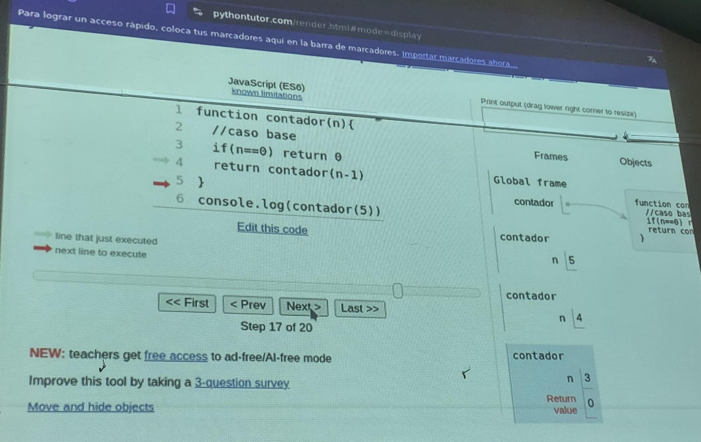
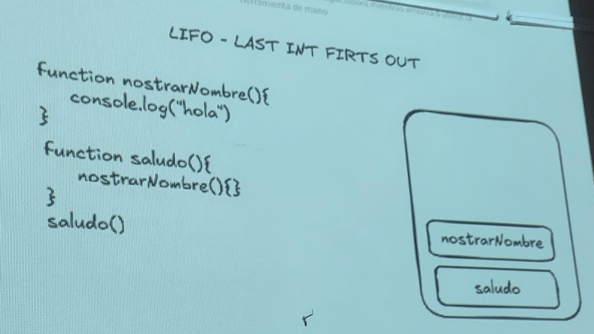
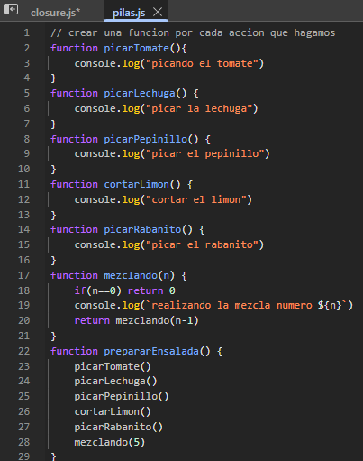
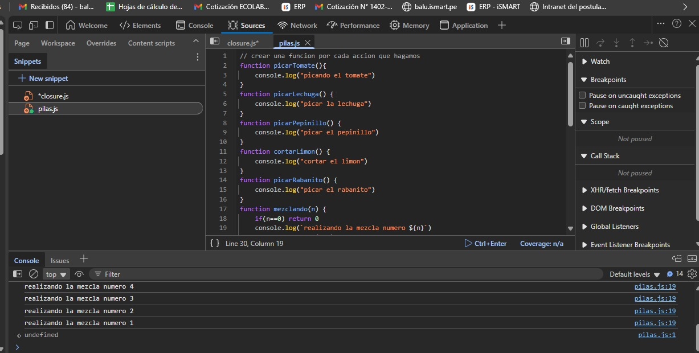
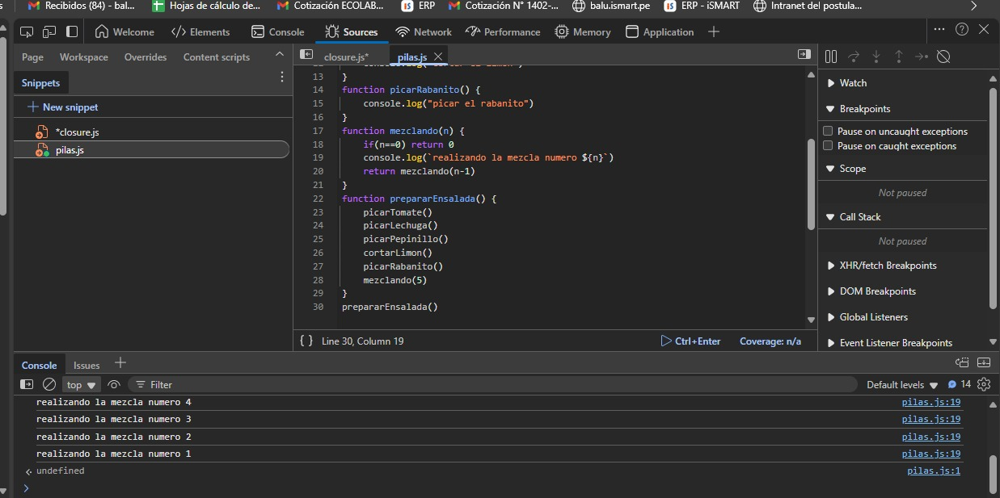
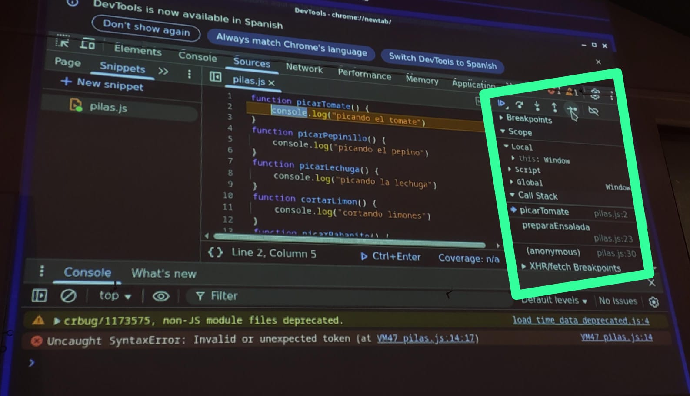

El archivode Js es una funcion, y el navegador la considera una funcion anonima.
# CLOUSURE
Una funcion que retorna una funcion.
```JS
function producto(valor){
    return numero=>numero*valor
}
let multi=producto(2)
/**
 let multi=numero=>{
 return numero*valor}
*/
console.log(multi(5)) //10
```
# RECURSION
Es como un contador se llama a si mismo.
En este ejemplo se llamara a si mismo y se usara a si mismo para sumar y llegar hasta 10.
```JS
function contador(n){
    // caso base
    if(n==0) return 0
    return contador(n-1)
}
console.log(contador(5))
```


# CALL STACK
Es una (tecnica algoritmica de ordenaminto al igual que el arbol de bytes) Tecnica que usa el entorno de ejecucion de JS.
Esta tecnica se llama `LIFO` que se dice que **el primero que entra es el ultimo en salir**, un ejemplo seria el caso de lavar platos, el primero en lavar pone el plato primero y los demas a medida que terminan lavan, ycolocan el plato encima del otro, al final el plato de la ultima persona es el plato queestara primero.






> [!TIP]
> Call back: Llamados a funciones anonimas
> Call stack: Pila de llamadas

Tipos de funciones anonimas
aqui poner la imagen de mi whatsapp

### AVERIGUAR: expresiones regulares: son simbolos que permiten comparar si un texto
contiene los caracteres que se pieden
Las expresiones regulares son patrones que se utilizan para hacer coincidir combinaciones
de caracteres en cadenas. En JavaScript, las expresiones regulares también son objetos.
Estos patrones se utilizan con los métodos `exec() y test() de RegExp, y con match(),
matchAll(), replace(), replaceAll(), search() y split()` métodos de String.

Usando una expresión regular literal, que consiste en un patrón encerrado entre barras, como sigue:
```JS
let re = /ab+c/;
```
Las expresiones regulares literales proporcionan la compilación de la expresión regular cuando se carga el script. Si la expresión regular permanece constante, su uso puede mejorar el rendimiento.

O llamando a la función constructora del objeto RegExp, de la siguiente manera:
```JS
let re = new RegExp("ab+c");
```
El uso de la función constructora proporciona una compilación en tiempo de ejecución de la expresión regular. Usa la función constructora cuando sepas que el patrón de la expresión regular cambiará, o no conoces el patrón y lo obtienes de otra fuente, como la entrada del usuario.