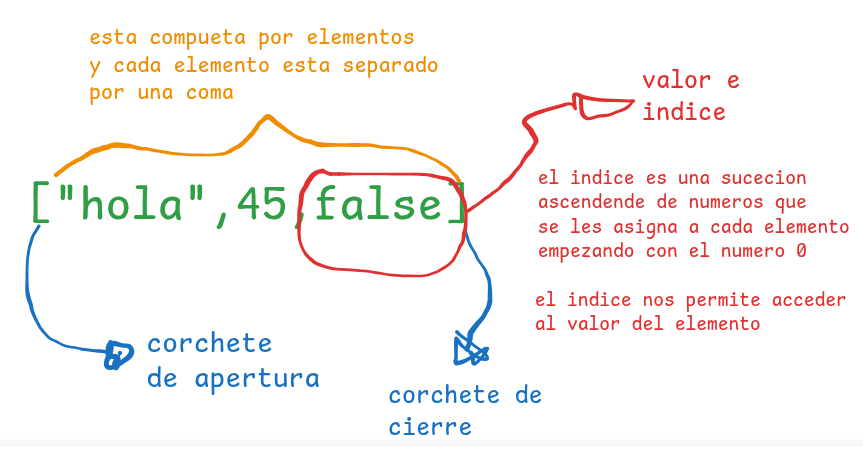
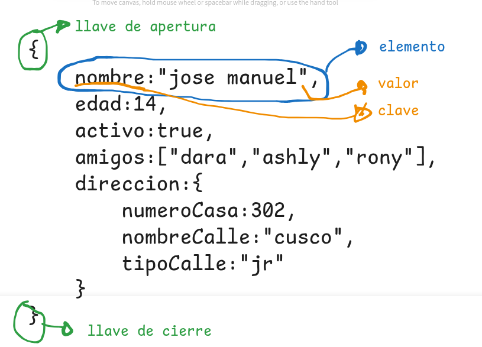
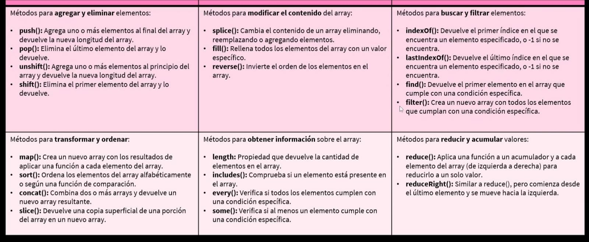

# TALLER DE REPASO DE JAVA SCRIPT
> [!WARNING] 
> Observacion: Quokka se debe ejecutar en cada archivo.

> [!TIP] 
> Quokka detecta que en nuestro proyecto tenermos nodejs y lo ejecuta para poder ver la consola en vivo.
## 1. TIPO DE DATOS
Es la manera de como podemos capturar la informacion.
Tenemos 2 clasificaciones:
> [!TIP] 
> JavaScript tiene funciones predetermindas por ejemplo para mostrar un mensaje por consola `console.log()`, para saber que tipo de dato estamos manejando en JS tambien tenemos una funcion por defecto llamada `typeof()`.
### Primitivos
Son datos que siempre existen.
1. `Numericos:`
   - enteros positivos
   - enteros negativos
   - decimal positivo
   - NaN (Not a Number)
   - **decimal negativo** (son losnumeros que mas bit ocupan en la memoria por el simbolo menos y el punto)
2. `Texto:`
   - **caracteres** (un caracter puede ser una linea de 8 bits, y en el codigo ascci depende de lasuma de 1 --> 10001001 - 97 - A)
   - **caracteres especiales** (tiene 16 bits --> 10001001 10001001- 256 - →)
   - **string** (texto largo - parrafo)
3. `Booleanos:`
   - true - 1
   - false - 0
### Estructurados
1. `Array (lista)`
   - array de tipo numerico
   - array de tipo string
   - array de tipo mixto
  Como alta estructura un array en javascript
  
2. `Objetos (diccionario)`
   - Son similares a las listas con las unica diferencia que en vez de tener **valor e indice** sus elementos trabajan con **clave y valor**
  Como esta estructurado un objeto en javascript
  
## 2. VARIABLES - Constantes (enlaces, binding)
Es la tecnica que se usa para apuntar a una direccion en memoria y al valor o dato relacionado o que se encentre almacenado en ese momento. Una variable puede cambiar de espacios de memoria.
Las `contanste` son fieles, solo tienen y se quedan con un solo espacio de memoria.

Tenemos dos pasos para crear una variable/constante
> [!WARNING] 
> **Observacion:** para crear una variable primero tenemos que crear el enlace luego darle al nombre de la ariable/constante: para las **variables:** tenemos las palabras reservadas `keywoard` - `let` - `var`, para las **constantes:** tenemos la palabra reservada `keyword` - `const`.

**Recomendacion**
- `let:` Usar cuándo el valor tendrá que variar.
- `var:` Evitar usar
- `const` Usar cuándo el valor será el mismo siempre.
  let y`var` ambos nos permite crear variables su única diferecia es el alcance, ámbito o **scope**.
## 3. OPERADORES
Su clasificacion general se divide en tres:
1. `Operadores unarios:` los operadores unarios son aquellos que tienen el opeador a la izquierda del valor (tipo de dato) y que retornan un nuevo valor.
   - operador de negacion
2. `Operadores binarios:` los operadores binarios son aquellos que estan en medio de dos valores y que retornan un unico valor.
   - operadores aritmeticos
   - operadores de comparacion
   - operadores logicos
3. `Operadores ternarios:` los operadores terciarios son aquellos que evaluan y retornan un solo valor.
   - operador condicional: se usan cuando tenermos la estructura if, se obtienen valores true o false.
> [!TIP] 
> EXPRECION: es un valor complejo que sera solucionado y nos retornara un nuevo resultado o valor. Todos los operadores son EXPRECIONES
## 4. CONTROLES DE FLUJO
Nuestros programas en JS contienen mas de una sentencia y las sentencias son ejecutadas una a una como si fuera una historia, de arriba hacia abajo. 
- `control de decision (if-else):` JavaScript nos permite permite crear caminos alternativos en nuestro programa, dependiendo de una desiciona esto se le conoce como caminos o ejecucioncondiciconal, que ejecutara una sentencia u otra teniendo en cuenta la condicion asi podemos crear multiples caminos u opciones en nuestro programa.
Si tenemos una condicion verdadera se ejecutara una sentencia, si tenemos una condicion false se ejecutara otra sentencia totalmente distinta.
> [!WARNING] 
> OBSERVACION: la ejecucion condicional rompe el flujo normal de un programa.
- `bucles (for):`
- `bucles (while):`
> [!TIP] 
> SENTENCIAS: es una linea de codigo que hace una sola cosa. Para diferenciar una sentencia al terminar una linea de codigo se termina con un ";".La sentencia esta conformada por valores, variables, funciones, etc.
## 5. FUNCIONES
## 6. Metodos para trabajar con datos estructurados
Se utilizan para manipular y operar sobre colecciones de datos, como arrays, listas, mapas, etc. Estos métodos, a menudo llamados métodos de clase, son bloques de código que encapsulan la lógica para procesar esos datos. Permiten realizar acciones como agregar, eliminar, buscar, ordenar y transformar los datos dentro de la estructura. 
1. `Acceder:`
2. `Crear:`
3. `Modificar:` `Une listas:` **CONCAT** permite que dos listas se unan o concatenen en un array [1,2]. **REVERSE** hace lo mismo pero en orden inverso [2,1].
4. `Insertar:` **UNSHIFT** permite agregar el elemento que deseamos al principio de una lista siempre y cuando este entre parentecis (). **PUSH** permite agregar el elemento que deseamos al final de una lista siempre y cuando este entre parentecis ().
5. `Eliminar:` **POP** elimina el ultimo elemento, mientras que **SHIFT** elimina el primer elemento del array
6. `Ordenar:` **SORT** quiero que ordene de manera ascendente, o de manera alfabetica [1,2,3] o [a,b,c].
7. `Filter:` queremos filtrar elementos que no cumplen con ciertas condiciones.
8. 

### "SCOPE" de "LET" y "VAR"
El scope se usa en variables.

Scope (ambitode ejecucion o el alcance). es como un contenedor que alverga todaslas variables que han sido declaradas dentro de un bloque o funcion del codigo. Dependiendo de donde y como se declare el ambito esta variable puede cambiar.

1. `GLOBAL:` **globalVar** es inicializada o declarada fuera del bloque.
2. `LOCAL:` **localVar** solo se puede acceder dentro de ese loque de codigo

- `VAR:` es un tipo de variable que sin importar en que bloque de codigo la declaremos podemos acceder desde cualquier lugar a este.
- `LET:` es un tipo de variable que solo podemos acceder unicamente a esta dentro un solo bloque de codigo.
## DOM