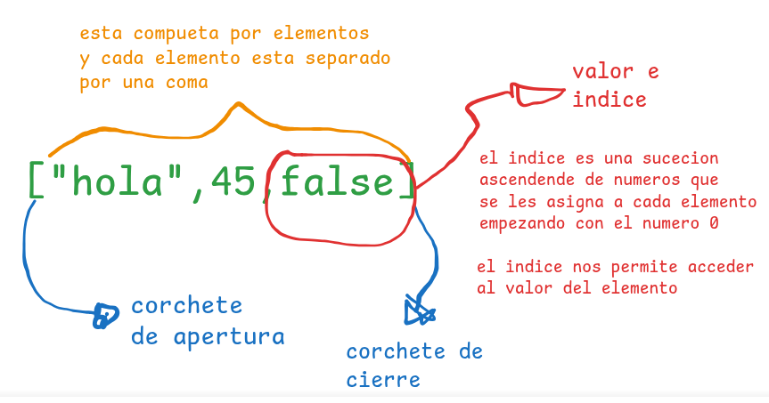
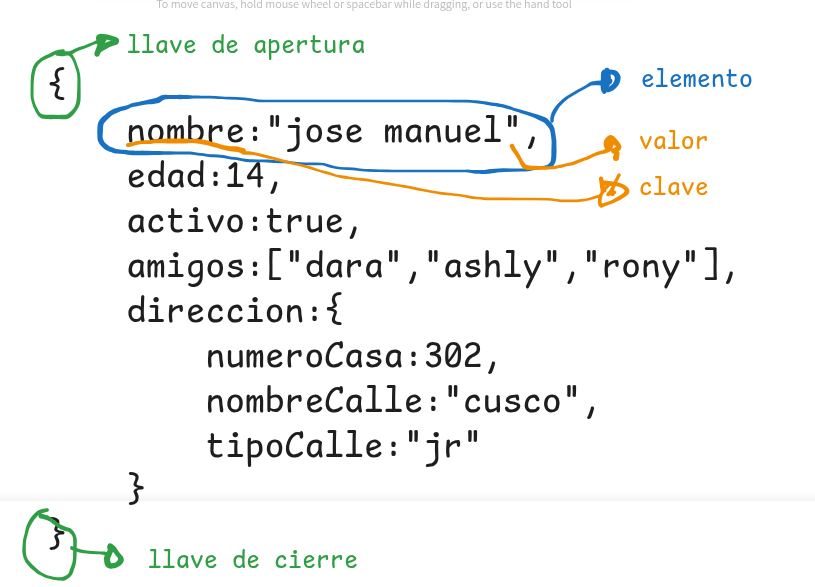
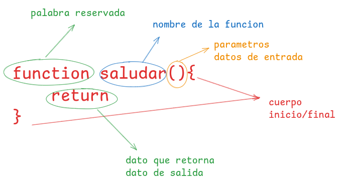
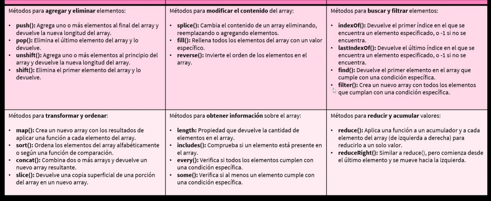
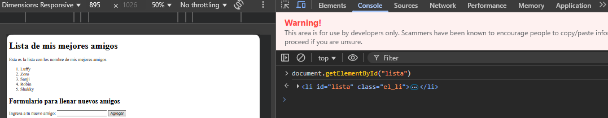
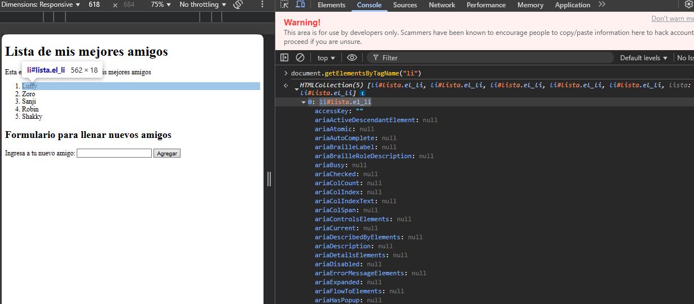
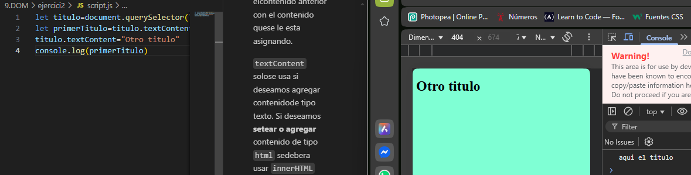

# TALLER DE REPASO DE JAVA SCRIPT
> [!WARNING] 
> Observacion: Quokka se debe ejecutar en cada archivo.

> [!TIP] 
> Quokka detecta que en nuestro proyecto tenermos nodejs y lo ejecuta para poder ver la consola en vivo.
## 1. TIPO DE DATOS
Es la manera de como podemos capturar la informacion.
Tenemos 2 clasificaciones:
> [!TIP] 
> JavaScript tiene funciones predetermindas por ejemplo para mostrar un mensaje por consola `console.log()`, para saber que tipo de dato estamos manejando en JS tambien tenemos una funcion por defecto llamada `typeof()`.
### Primitivos
Son datos que siempre existen.
1. `Numericos:`
   - enteros positivos
   - enteros negativos
   - decimal positivo
   - NaN (Not a Number)
   - **decimal negativo** (son losnumeros que mas bit ocupan en la memoria por el simbolo menos y el punto)
2. `Texto:`
   - **caracteres** (un caracter puede ser una linea de 8 bits, y en el codigo ascci depende de lasuma de 1 --> 10001001 - 97 - A)
   - **caracteres especiales** (tiene 16 bits --> 10001001 10001001- 256 - →)
   - **string** (texto largo - parrafo)
3. `Booleanos:`
   - true - 1
   - false - 0
### Estructurados
1. `Array (lista)`
   - array de tipo numerico
   - array de tipo string
   - array de tipo mixto
  Como alta estructura un array en javascript
  
2. `Objetos (diccionario)`
   - Son similares a las listas con las unica diferencia que en vez de tener **valor e indice** sus elementos trabajan con **clave y valor**
  Como esta estructurado un objeto en javascript
  
## 2. VARIABLES - Constantes (enlaces, binding)
Es la tecnica que se usa para apuntar a una direccion en memoria y al valor o dato relacionado o que se encentre almacenado en ese momento. Una variable puede cambiar de espacios de memoria.
Las `contanste` son fieles, solo tienen y se quedan con un solo espacio de memoria.

Tenemos dos pasos para crear una variable/constante
> [!WARNING] 
> **Observacion:** para crear una variable primero tenemos que crear el enlace luego darle al nombre de la ariable/constante: para las **variables:** tenemos las palabras reservadas `keywoard` - `let` - `var`, para las **constantes:** tenemos la palabra reservada `keyword` - `const`.

**Recomendacion**
- `let:` Usar cuándo el valor tendrá que variar.
- `var:` Evitar usar
- `const` Usar cuándo el valor será el mismo siempre.
  let y`var` ambos nos permite crear variables su única diferecia es el alcance, ámbito o **scope**.
## 3. OPERADORES
Su clasificacion general se divide en tres:
1. `Operadores unarios:` los operadores unarios son aquellos que tienen el opeador a la izquierda del valor (tipo de dato) y que retornan un nuevo valor.
   - operador de negacion
2. `Operadores binarios:` los operadores binarios son aquellos que estan en medio de dos valores y que retornan un unico valor.
   - operadores aritmeticos
   - operadores de comparacion
   - operadores logicos
3. `Operadores ternarios:` los operadores terciarios son aquellos que evaluan y retornan un solo valor.
   - operador condicional: se usan cuando tenermos la estructura if, se obtienen valores true o false.
> [!TIP] 
> EXPRECION: es un valor complejo que sera solucionado y nos retornara un nuevo resultado o valor. Todos los operadores son EXPRECIONES
## 4. CONTROLES DE FLUJO
Nuestros programas en JS contienen mas de una sentencia y las sentencias son ejecutadas una a una como si fuera una historia, de arriba hacia abajo. 
1. `control de decision (if-else):` JavaScript nos permite permite crear caminos alternativos en nuestro programa, dependiendo de una desiciona esto se le conoce como caminos o ejecucioncondiciconal, que ejecutara una sentencia u otra teniendo en cuenta la condicion asi podemos crear multiples caminos u opciones en nuestro programa.
Si tenemos una condicion verdadera se ejecutara una sentencia, si tenemos una condicion false se ejecutara otra sentencia totalmente distinta.
> [!WARNING] 
> OBSERVACION: la ejecucion condicional rompe el flujo normal de un programa.
1. `Bucles (for):` **(para)** Realiza un bucle una determinada cantidad de veces. Es un bucle controlado por un contador, que lo tiene implicado en su sintaxis.
Se compone de 3 partes:
- **Iniciación  de la variable:**  se utilizará en la condición, y solo se ejecuta una vez al principio del ciclo.
- **Condición de fin del ciclo:** la expresión se evalúa al inicio de una interacción.
- **Modificación de la variable:** se ejecuta al final de cada interacción.
1. `Bucles (while):` **(mientras)** Permite que un bloque de codigo se repite una cantidada de veces "mientras" se cumpla una derminada condicion.
- La condicion se evalua siempre al **inicio del ciclo/bucle**.
- Si la condicion es valida, **ingresa bucle** y **ejecuta el codigo**
- Cuando la condicion no se cumple mas lo que pasa con el bucle es que automaticamente se corta, no se repite mas y termina la ejecucion del programa a menos que haya otra condicion despues.
> [!TIP] 
> SENTENCIAS: es una linea de codigo que hace una sola cosa. Para diferenciar una sentencia al terminar una linea de codigo se termina con un ";".La sentencia esta conformada por valores, variables, funciones, etc.
## 5. FUNCIONES
La funcion en javascript son bloques de codigo que se ejecutan de manera independiente, podemos decir tambien que son `mini programas` que toman datos comso entrada y retornan otros datos como salida.
Las funciones son fundamentales para el ordenamiento del codigo,ademas nos permite separar de una manera las ordenadanuestra logica y evitar repetir el codigo muchas veces.
Existen 3 tipos de funciones:
#### 1. Funciones de declaracion
Este tipo defunciones la mas conocida y la mas usada, su estructura es la siguiente:

> [!TIP] 
> las funciones siempre deben recibir dato de entrada y de salida. Solo retorna un dato que es la respuesta

#### 2. Funciones por expresión
`Una función que se almacena en una variable, permitiendo su ejecución posterioR.` Una funcion creada en su forma de expresion solo puede ser ejecutada despues de que la ejecucion haya llegado a la declaracion de esa variable. Antes de la ejecucion llegue ahi, dicha funcion no existira.


#### 3. Funciones flecha (arrow fuction)
Las Funciones Flechas son una forma corta de escribir funciones que aparece en JavaScript a partir de ECMAScript 6. Básicamente, se trata eliminar la palabra function y añadir => antes de abrir las llaves.

Esta forma se utiliza cuando las funciones estan puestas en su modo de expresion `let func =(arg1, arg2, ...argN) => expression`. Se llaman asi por que utiliza una flecha para indicarlas y es lomismo que escribir esto:`let func = function(arg1, arg2, ...argN) {return expression;};`
> [!TIP] 
> `=>`  : en base a la entrada devuelve esta salida

## 6. Metodos para trabajar con datos estructurados
Se utilizan para manipular y operar sobre colecciones de datos, como arrays, listas, mapas, etc. Estos métodos, a menudo llamados métodos de clase, son bloques de código que encapsulan la lógica para procesar esos datos. Permiten realizar acciones como agregar, eliminar, buscar, ordenar y transformar los datos dentro de la estructura.

Los metodods son funciones que dan funcionalidades extras a los tipos de datos e los cuales se aplica.
un metodo es antesedido por un tipo de datos y un punto.
**Ejemplo**
el ejemplo mas claro de un metodo es el `.length` - este metodo nos permite o nos retorna la cantidad de caracteres de un string o la cantidad de elementos de una lista.
```js
"hola".length //4
[2,5,4,6,7].length //3
```
> [!TIP] los metodos en su mayoria solo se aplica a tipo de datos string, listas y objetos, en su gran parte son aplicaciones para listas.

### 6.1. Metodos para STRING
#### 1. LENGTH
devuelve la longitud de una cadena
```js
let mensaje="hola como estan"
console.log(mensaje.length)
//retorna -> 15
```
#### 2. toLowerCase
devuelve una cadena en minusculas
```js
let texto="HOLA"
console.log(texto.toLowerCase())
//retorna -> hola
```
#### 3. toUpperCase
devuelve una cadena en minusculas
```js
let texto="hola"
console.log(texto.toUpperCase())
//retorna -> HOLA
```
#### 4. concat
combina el texto de dos a mas cadenas
```js
let nombre="kcapa"
let saludo="hola"
//let concatenando=saludo+nombre
console.log(saludo.concat(nombre))

let cad1="oh "
let cad1="me "
let cad1="vengo"
console.log(car1.concat(cad2,cad3))
//retorna -> oh me vengo
```
#### 5. trim
este metodo elimina los espacios que existen al inicio o final de una cadena o texto
```js
let texto ="   hola"
let nuevoTexto=texto.trim() //hola
let otroTexto="hola"
let nuevoOtroTexto=otroTexto.trim() //hola
```
#### 6. slice - corte
Este metodonos permite extraer partes de una cadena especificando sus indices, donde comenzar y hasta donde mostrar ( la mayoria de metodos se usan en string y arrays).
```js
let parrafo ="hola soy percy"
// solo quiero que me muestre percy
//siempre al utimo numero lo corta, por ello aumentar uno
parrafo.slice(9) //percy (para todo en adelante de 9, o se "10, 11, etc)
parrafo.slice(5.8) //soy (para unaparte en especifico)

// para el caso de que no queramos que el texto original se modifique podemos alamcenarlo en una variable.
let nombre=parrafo.slice(9) 
let soy=parrafo.slice(5.8)
```
#### 7. split
Este metodo retorna una lista basandose en un separador que se le indique.
**Combierte cadenade texto a una lista usando un separador que es usado como parametro**
```js
let parrafo="solo se que nada se"
parrafo.split("") //["solo","se","que","nada","se"]

//esto hara que me devuelva las palabras divididas en base a lo que hay en los parentecis
let url="google.om/search?=gatitos"
let gatitos=url.split=("=") //["google.om/search?","gatitos"]
console.log(gatitos[1]) //gatitos
let listaFrutas="manzana,tomate,pera,naranja"
listaFrutas.split=(",") // ["manzana","tomate","pera","naranja"]
```

### 6.2. Metodos para LISTAS
#### Crear una lista
```js
let lista=[]
```
#### Agregar elementos a una lista
Agregar a traves del indice
```js
lista[0]="manzana"
``` 
#### PUSH
El metodo PUSH (empujar al final) agrega elementos al final de una lista
```js
let lista=[]
lista.push("manzana")
``` 
```js
// Usando UNSHIFT y PUSH
let amigos=["e","i","o"]
amigos.unshift("a")
amigos.push("u")
console.log(amigos);
// retorna ["a","e","i","o","u"]
``` 

#### UNSHIFT
El metodo UNSHIFT agrega elementos al inicio de una lista
```js
let amigos=["flor","rocio","percy"]
amigos.unshift("ronny")
// retorna ["ronny","flor","rocio","percy"]
``` 
### Removiendo elementos
#### POP
el metodo POP al contrario de PUSH extrae el ultimo elemento de una lista
```js
let frutas=['🍎','🍍','🍉','🍐','🍌','🍒']
let cerecita=frutas.pop()
cerecita // '🍒'
frutas // retorna ['🍎','🍍','🍉','🍐','🍌']
```
#### SHIFT
El metodo `pop` al contrario de unshif, extrae elprimer elemento de una lista.
```js
let frutasDos=['🍎','🍍','🍉','🍐','🍌','🍒']
frutasDos.shift() // se lo queda para él, primer elemento
frutasDos.pop() // se lo queda para él, el ultimo elemento
frutasDos // ['🍍','🍉','🍐','🍌']
```
### Eliminando elementos de una lista
#### DELETE
Elimina un elementoen base a su indice `(no elimina el espacio de memoria, solo el tipo de dato).`
```js
let texto=["hola","como"," ","estas"]
delete texto[2]
texto 
// ["hola","como","undefined","estas"]
```
#### SPLICE
Este metodo elimina (tambien agrega) el elemento en base a su indice y a la cantidad de elementos a eliminar `necesita 2 parametros (indice,cantidad a eliminar)`: INDICE y cuantos elementos quiero ELIMINAR
```js
let vocal=["a","e","i","o","u"]
vocal.splice(2,1)
vocal // ["a","e","o","u"]
vocal.splice(0,3)
vocal // ["u"]
```
> [!WARNING]
> A diferencia de DELETE, aqui SI se ELIMINA en el primer splice ya no se puede usar para el segundo splice. Lo que se elimino en el 1er splice ya no aparece en el 2do splice ya que el codigo se reescribe. Por ello tener cuidado.

### Combinando o uniendo listas
#### CONCAT
Este metodo crea un nuevo ARRAY que contiene los elementos del array original seguido por los elementos de unos a mas arrays proporcionados.
```js
let amigosPrimaria=['alfredo','luis','edgar']
let amigosSecundaria=['edison','remy','miguel']
let amigosSuperios=['josue','marlon','handy']
let friends=amigosPrimaria.concat(amigosSecundaria,amigosSuperios)
friends // ['alfredo','luis','edgar','edison','remy','miguel','josue','marlon','handy']
```
### Metodos para iterar elementos
####

### Metodos para buscar elementos
### CALL BACK
Es una funcion que ejecuta como parametro una funcion anonima y retorna la informacion que ejecuta la funcion anonima.
son funciones que reciben como parametro una funcion anonima.
#### FIND (es un call back)
Recorre todos los elementos y devueleve lo que le pido.
En cada iteracion el parametro guarda cada elemento de la lista.
es un metodo call back, al que le pasamos una funcion.
```js
let amigos=['alfredo','luis','edgar']
amigos.find(el=>{el=='alfredo'})
// parametro : "el=>" -> guarda el elemento : "{el=='alfredo'}"
```
#### FILTER (es un call back)
``` js
let numero=[5,6,10,2,0,-14,20,50,9,11]
let numerosMenores=numeros.filter(num=>num<11)
```

### Metodos para iterar una lista
Para modificar e iterar valores
#### 1. forEach
Este metodo ejecuta una funcion anonima por cada elemento de un array.
**Devuleve el valor de cada elemento de lista, pero NO devuelve en una lista**.
forEach recorrera a todos los elementos de una lista `numeros=[1,2,3,4,5,6]` y aplicara la condicion `console.log(n+1)` segun inidique.
```js
let numeros=[1,2,3,4,5,6]
numeros.forEach(n=>{console.log(n+1)}) // una funcion por cada elemento
// 2,3,4,5,6,7
```
#### 2. map
Este metodo ejecuta una funcion anonima por cada elemento de un array, generando una nueva lista. 
**Devuelve nueva lista (array) soloque con la funcionque le haya aplicado**
```js
let number=[1,2,3,4,5,6]
newNumber=number.map(n=>{return n+1})
console.log(newNumber)
// [2,3,4,5,6,7]
```

### Metodos para buscar elementos en una lista
#### 1. INCLUDES
Este metodo busca un valor en especificoy devuelve unvalor boleano, e caso de encontrar el valor buscado retorna **true** caso contrario **false**.
**Muestra si un valor esta dentro de una lista**
```js
let vocales=["a","i","o","u"]
let buscaE=vocales.includes("e")
// retorna: false
let buscaA=vocales.includes("a")
// retorna: true
```
> [!WARNING]
> todos los metodos siempre deben estar almacenandos en una variable

#### 2. FILTER
Este metodo se usa para encontrar elementos dentro de una lista que cumplan con cierta condicion.
**Nos retorna listas nuevas con la condicion ya ejecutada**
```js
let numeros=[2,4,5,7,8,1,2,6]
// deseo una lista con los numeros que sea menor a 4
let nuevosNumeros=numeros.filter(n=>{n<4})
```

#### FIND
Este metodo se usa para encontrar el primer elementoque  cumpla con cierta condicopn, a diferencia de filter solo retorna un elemnto que cioncida con la condicion.
```js
let lisNumeros=[10,11,3,20,5]
//devolver el numero mayor a 10
let menorDiez=lisNumero.find(n=>{return n>10})
console.log(menorDiez)
// retorna 11 - el primer elemento que coincide con la condicion.
```

### 6.3. Metodos para objetos
#### 1. Creando un objeto
```js
// objeto o diccionario vacio
let objeto={}
```

#### 2. Agregando elementos a un objeto
recuerden que el elemento de un objetos esta conformado por `clave:valor`
```js
objeto["nombre"]="ruth"
objeto["edad"]=18
objeto["CUI"]=60414454
```
#### 3. Actualizando elementos de nuestro objeto
Para realizar la actualizacion del valor de un elemento tenemos que acceder a travez de su clave y asignarle el nuevo valor.

**OBSERVACION:** 
poniendo la misma clave y cambiando el valor
```js
objeto["edad"]=19
```
#### 4. Elemento un elemento de nuestro objeto
Para eliminar unelemento de unobjeto hacemos usode un operador unario `delete`.
```js
delete objeto.CUI
```

___
> [!WARNING]
> en OBJETOS no se usa LENGTH solo en LISTAS y STRING

> [!TIP]
> objeto: "clave:valor"
> 
> lista: "indice:valor"
___

### 6.3. Metodos para STRING
## Metodos para ARRAY
1. `Acceder:`
2. `Crear:`
3. `Modificar:` `Une listas:` **CONCAT** permite que dos listas se unan o concatenen en un array [1,2]. **REVERSE** hace lo mismo pero en orden inverso [2,1].
4. `Insertar:` **UNSHIFT** permite agregar el elemento que deseamos al principio de una lista siempre y cuando este entre parentecis (). **PUSH** permite agregar el elemento que deseamos al final de una lista siempre y cuando este entre parentecis ().
5. `Eliminar:` **POP** elimina el ultimo elemento, mientras que **SHIFT** elimina el primer elemento del array
6. `Ordenar:` **SORT** quiero que ordene de manera ascendente, o de manera alfabetica [1,2,3] o [a,b,c].
7. `Filter:` queremos filtrar elementos que no cumplen con ciertas condiciones.
8. 

### "SCOPE" de "LET" y "VAR"
El scope se usa en variables.

Scope (ambitode ejecucion o el alcance). es como un contenedor que alverga todaslas variables que han sido declaradas dentro de un bloque o funcion del codigo. Dependiendo de donde y como se declare el ambito esta variable puede cambiar.

1. `GLOBAL:` **globalVar** es inicializada o declarada fuera del bloque.
2. `LOCAL:` **localVar** solo se puede acceder dentro de ese loque de codigo

- `VAR:` es un tipo de variable que sin importar en que bloque de codigo la declaremos podemos acceder desde cualquier lugar a este.
- `LET:` es un tipo de variable que solo podemos acceder unicamente a esta dentro un solo bloque de codigo.

## 7. es6
Es una implementacion de Egmas script 6
### Arrow function
#### Destructuring
Este es una tecnica para el desempaquetado de listas u objetos en variables.
Esta tecnica facilita el acceso a los elementos de una lista u objeto.
Nos permite crear objetos para cada variable o algo asi
```js
let alumno={
   "nombre":"miguel",
   "edad":"17"
}
console.log(alumno.nombre)
console.log(alumno["edad"])
// desestructuracion
let {nombre,edad}=alumno
```
> [!TIP]
> SPREAD operation :permite convertir texto a lista (como SPLIT)
```js
let texto="hola como estan alumnos"
let nuevaLista=[...texto]
nuevaLista
```
> [!TIP]
> CALL BACK: Es una funcion que ejecuta como parametro una funcion anonima y retorna la informacion que ejecuta la funcion anonima.

## 8. DOM (Document Objetc Model)
- Segun sus siglas es Modelo de Objeto de Documento.
- Para web es una API del navegadorm, eso significa que nos proporcionauna interfaz para comunicarnos entre HTMLy JavaScript
- Segun sufuncionalidad DOM es elencargado de convertir documentos `HTML` y `CSS`enobjetos de `JavaScript` o en un arbol.
- Para `JavaScript` el `DOM` es un objeto con el que podemos leer ymodificar a nuestro antojo.
La manera como `DOM` nos permite interactual con nuestros documentos `html` y `css` son a travez de `selectores`.

### SELECTORES
Es la manera de como podremos manipular el DOM, este es el primer paso que debemos dominar para realizar operaciones de lectura o modificaciones.
### Captura de elementos
#### Selectores tradicionales
Son metodos del documento, porque DOM trabaja con el documento.
```js
// --selectores por ID
//<section id="mi_div"></section>
document.getElementById("mi_div")
// solo en este caso retorna UN ELEMENTO
```

```js
//--selectores por su atributo NAME
//<input name="dni" value="34556">
// dni=34556
document.getElementByName("dni")
// retorna TODOS los elementos
```

```js
// --selectores por su etiqueta TAG
// <h1></h1>
// crea un section en html automaticamente
document.getElementByTagName("h1")
```

```js
// --selectores por su CLASS
//<div class=rojo></div>
document.getElementByClassName("rojo")
```

> [!TIP]
> En la programacionweb `DAW` se hace eluso de 2 tecnicas.
> **Setter and Getter**
> 1. Obtencion de datos (get).
> 2. Creacion de datos (set) (guardar).

#### Selectores modernos o avanzados
```js
// para la captura de un elemento, o el primer elemento que coincida con la busqueda
document.querySelector()
//  BUSCA Y OBTIENE el elementoque coincida con el nombre de la clase
document.querySelector(".nombre_clase")

//  BUSCA Y OBTIENE el elementoque coincida con el nombre del id
document.querySelector("#nombre_id")

//  BUSCA Y OBTIENE el elementoque coincida con el nombre de la etiqueta
document.querySelector("p")
// acceder a traves de dni, como el tag name
document.querySelector(".input[name="dni"]")

// Para acceder a todas las coincidencias
// esto retorna un array con todas lascoincidencias
document.querySelectorAll(".nombre_clase")

// si queremos acceder gerarquicamente se accede comoen el caso de poner una imagen de mipc en un archivo html, debo ingresar carpeta dentro de otra carpeta
```

#### Acceder a contenido y actualizar contenido
Una vez capturado el elemento con `querySelector` pueden hacer uso de `textContent` para acceder alcontenido del elemento,de esta misma forma podemos editar o actualizar el contenido `textContent="hola"` esto es loque actualiza elcontenido anterior con el contenido quese le esta asignando.

`textContent` solose usa si deseamos agregar contenidode tipo texto. Si deseamos **setear o agregar** contenido de tipo `html` sedebera usar `innerHTML`
```js
// <p id="text">este es un contenido</p>
let etiquetaP=document.querySelector("#text")
// de mi etiqueta P accede al contenido
console.log(etiquetaP.textContent)

//este es un contenido (pero es solo para texto)
etiquetaP.textContent="nuevo texto"
console.log(etiquetaP.textContent)
//nuevo texto

//este es un contenido (pero el contenido tiene etiquetas html)
//<div id="contenedor"></div>
let div=document.querySelector("#contenedor")
div.innerHTML="<p>este es un parrafo</p>">
```
